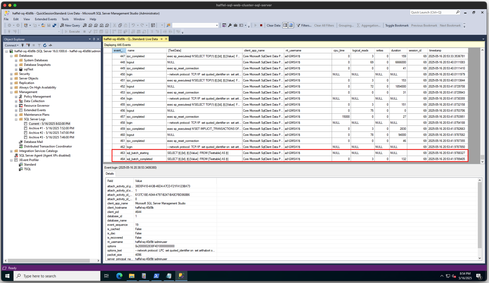

## Example gMSA SQL Workload

This repository contains an example ASP .NET Core _Razor_ application which connects to a Microsoft SQL Database using connection strings. When run in a container which assumes the identity of a gMSA, this application will be able to perform CRUD operations against a sample database table `testtable` (assuming you have properly configured user permissions in your SQL Server and AD domain). To add support for additional tables, refer to the [Microsoft Documentation](https://learn.microsoft.com/en-us/aspnet/core/tutorials/razor-pages/model?view=aspnetcore-9.0&tabs=visual-studio).

While this is a .NET Core application, running using the base image `dotnet/aspnet:8.0-nanoserver-ltsc2022`, the same authentication flow should apply when running applications directly in the IIS base image. 

### Building

As this is a Windows container workload, the image must be built using a Windows machine or VM (preferrably Windows server 2022). The image may need to be rebuilt depending on the environment which you will deploy to. When running on Windows Server 2019 and 2022, all workloads must use a matching base image. By default, this project uses a Windows nanoserver 2022 base image. To run on Windows 2019 nodes, the base images must use `mcr.microsoft.com/dotnet/aspnet:8.0-nanoserver-ltsc2019` instead.

To build a new version of this image simply run `docker build -f SamplegMSAApp/Dockerfile . -t <NAME>:<TAG>`. 

### How to run in Kubernetes

#### Prerequisites 

In order for this workload to properly authenticate with a domain joined SQL Server, a solution for adding gMSA's into containerized workloads must be properly configured. This workload has been tested against the Rancher solution, [Rancher-plugin-gmsa](https://github.com/rancher/rancher-plugin-gmsa).

#### Environment Considerations 

The purpose of this project is to demonstrate how a Windows container can connect to a MS SQL server using integrated authentication (via a gMSA). In order to properly demonstrate this, an environment similar to the following is required 

1. An Active Directory environment and Domain
2. A machine running Microsoft SQL Server which is joined to the Active Directory Domain.
   1. The required Users and gMSA accounts must be configured in both Active Directory, and within MS SQL server (to allow for CRUD requests) 
3. A Windows Kubernetes cluster, with Windows nodes that are NOT domain joined. 
   1. As the Windows node will not be domain joined, you will not be able to address the MS SQL server by name (as the node will have no way to contact the Active Directory DNS server). 
4. A solution for integrating gMSA accounts into containerized workloads, such as [rancher-plugin-gmsa](https://github.com/rancher/rancher-plugin-gmsa)

#### Example Workload

Once the prerequisites have been satisfied, you can utilize the `example-deployment.yaml`. This manifest contains a sample Kubernetes deployment and Node Port service which can be used to access the application UI. The example manifest requires that the workload run on Windows 2022 nodes. 

### Validating gMSA Functionality

In addition to simply utilizing the UI exposed by this application to make requests to the database, you can further confirm that requests are being made by the expected gMSA by utilizing [Microsoft's SQL Server Management Studio](https://learn.microsoft.com/en-us/ssms/sql-server-management-studio-ssms). When installed and connected to the relevant SQL server, viewing the activity log will show the exact user making requests via the UI. 

A screenshot of a gMSA making a request

